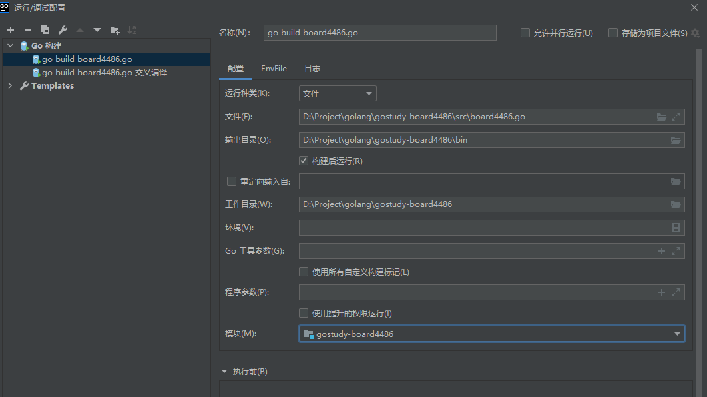
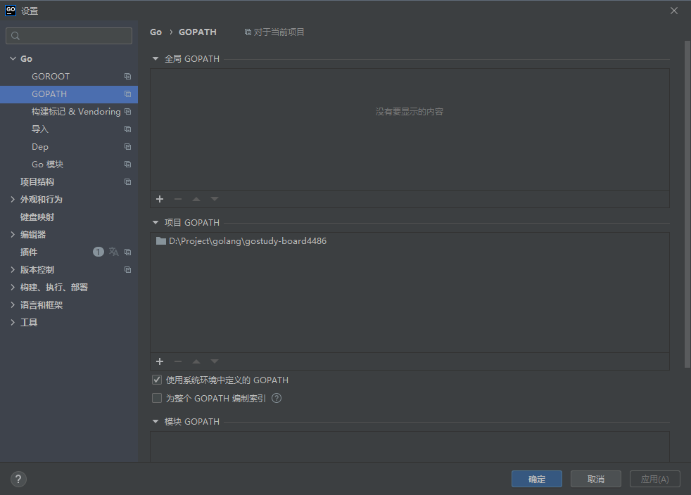
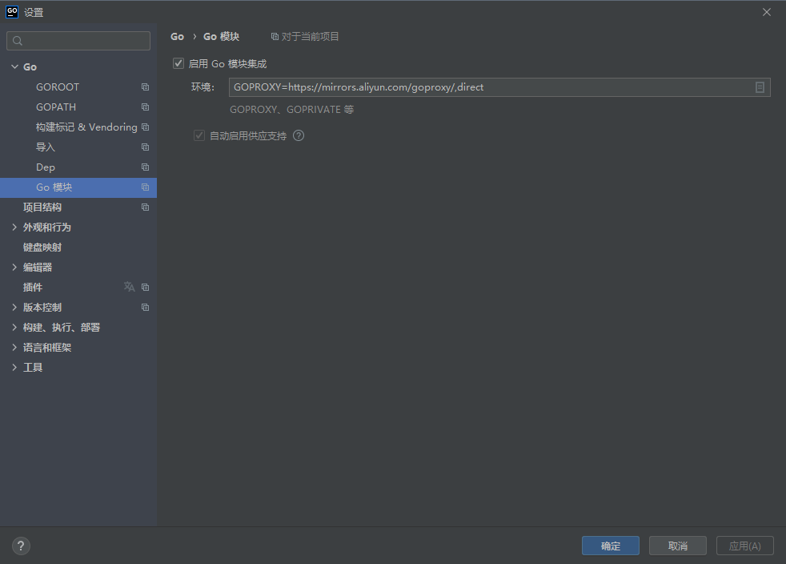

# Board4486

## 关键词

- golang 1.16
- gin
- mysql
- 前后端分离
- yaml配置化
- 破烂 jquery+bootstrap 大法好

## 项目结构

```

-/
 /--bin                     输出程序
 /--config                  配置文件夹
    /--config.yaml.sample   配置文件模板，请改成 config.yaml 使用
 /--doc                     说明文档
 /--pkg                     go module 的pkg文件夹，可以不用
 /--sql                     数据库初始化SQL
 /--src
    /--controller           控制器层
    /--httpserver           Http服务器(gin)
    /--router               路由
    /--service              服务层
    /--board4486.go         主程序
 /--static                  静态文件(html/css/js)

```

## 启动方法

1. 配置`GOROOT`为当前git仓库的根目录`/`
1. 到`/src`目录下执行`go mod tidy`自动下载维护依赖
1. 在git仓库根目录`/`为执行目录，执行程序`/src/board4486.go`

## Goland参考配置



